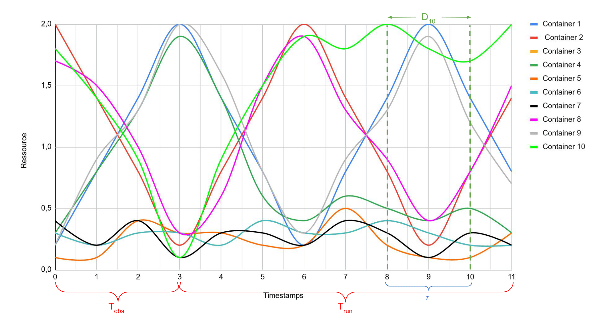
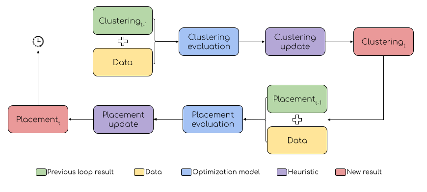

.. _process:

===================
Process explanation
===================

The :term:`hots` package provides a hybrid methodology, using learning and optimization methods for
handling time-series based applications.

The learning part allows us to have profiles from objects consumptions (containers in our case),
thanks to clustering problem. This clustering is used to help solving business problem (containers
placement in our case). These solutions (clustering + placement) must then be updated in time based
on future resource consumption evolution.

After giving some helpful preliminary information, the analysis period, in which we get first
solutions, is explained before the loop period, in which we have to update the solutions,
simulating a streaming process.

Preliminary information
=======================

In order to give the needed details, we use the data example *thesis_ex_10* provided with the
package (in :file:`tests/data` folder).

This example gives resource consumption from 10 containers, with 2 nodes, on 6 datapoints
following these profiles :

In order to process all the provided datapoints, we identify 3 main time-related points :

- Two periods : as previously mentioned, the full process is composed by an analysis period (T\ :sub:`obs`\ ), used to initialize solutions based on first historical data, and a running period (T\ :sub:`run`\ ) in which a loop is executed iteratively, updating the existing solutions if needed. The separation between these periods is set by the parameter :code:`sep_time` ; 
- Time windows : during the running period, the loop evaluating and updating the solutions is executed taking into account data within a time window (:math:`\tau`, set by the parameter :code:`window_duration`) ;
- Time progress : in order to progress over time, and to consider new data for running a new loop, we use the parameter :code:`tick` indicating how many new datapoints we must wait for running a new loop.

Analysis period
===============

The analysis period is used to initialize the tackled problems solutions, so in our case :

- the clustering : solved by various well-known algorithms : Kmeans (by default, `see here <https://scikit-learn.org/stable/modules/generated/sklearn.cluster.KMeans.html>`_), hierarchical (`details <https://scikit-learn.org/stable/modules/clustering.html>`_) or spectral method (`reference here <https://people.csail.mit.edu/dsontag/courses/ml14/notes/Luxburg07_tutorial_spectral_clustering.pdf>`_) ;
- the containers placement : different heuristics have been developped to place containers on nodes :

  - `distant_pairwise` (default) : take two most distant clusters (from their mean profile), and assign by pair (one container from each cluster) on the first available node, and so on ;
  - `ffd` : based on "first-fit decreasing" bin-packing heuristic : order clusters by decreasing variance, place all containers belonging to the clusters in this order. For each container, try to place it on a node decreasing the node's variance. If not possible, place it on the node whose variance increases the least.
  - `spread` : each container is assigned iterating over nodes (clustering is not used) ;

Loop period
===========

The following picture sums up the loop main steps :

Both clustering and business problem (placement here) are updated following a two-phases
methodology :

#. Evaluate the current solution (from previous loop or from analysis period if this is the first loop) ;
#. Update the solution using evaluation information and a re-assignment heuristic.

The evaluation step is done using an optimization model, in which we add current solution
information in order to build a conflict graph thanks to some optimization properties. See section
:ref:`pyomo` for more information about these optimization models and their use.

From the conflict graph, we retrieve a list of containers that have to be re-assigned (to a new
cluster or a new node). They are then re-assigned using heuristics, optimizing defined local
objectives.